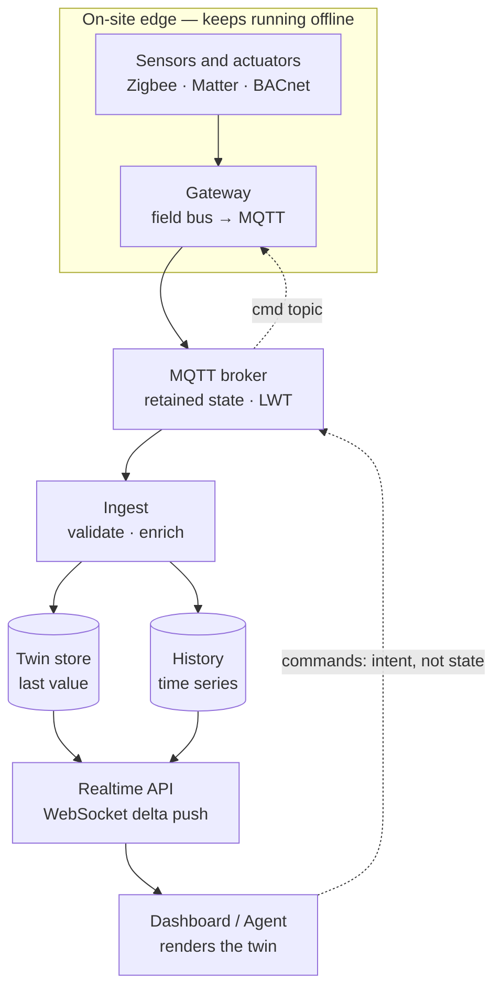

# HomeOS

**One brain for the whole home.** An all-in-one smart home platform — AI agent,
management dashboard, and automation engine on top of a protocol-agnostic
hardware abstraction layer.


**[Landing page →](https://aredwan-xyz.github.io/homeos/)**

```bash
npm install && npm run dev    # zero containers, zero hardware needed
open http://localhost:4700
```

That's the entire setup. An embedded MQTT broker, ingest pipeline, digital
twin, time-series history, WebSocket API, live dashboard, and a simulated
five-room sensor fleet come up in one process group.

## Why

Most smart homes are a pile of vendor apps that don't talk to each other.
HomeOS is one system that senses, decides, and acts across every device:

- **Agent** — a conversational + autonomous AI layer that understands the
  home's live state ("why is the studio warm?"), takes actions with
  confirmation, and proposes automations from observed patterns.
- **Management** — a premium dashboard: live floor plan, per-room climate and
  lighting control, energy analytics, device health, scenes.
- **Automation** — a rules/scenes engine that runs at the edge (works with the
  internet down), with safety interlocks and an approval gate for risky actions.
- **Hardware** — protocol-agnostic: Matter/Thread and Zigbee first (via
  Zigbee2MQTT), then Z-Wave, BLE, and commercial buses (BACnet/IP, Modbus), so
  the same core scales from a flat to a building.

## Architecture

The dashboard never talks to devices — it renders a **digital twin**. Three
planes, strictly separated:



1. **Telemetry up** — devices publish readings; the broker holds retained
   last-known state (instant dashboard loads) and Last Will messages (free
   offline detection); ingest validates and writes to the twin + history.
2. **Live state** — the twin is the single source of "current truth"; the API
   pushes deltas over WebSocket; clients coalesce updates per animation frame.
3. **Commands down** — the dashboard publishes *intent* to command topics; the
   actuator's state **echo** confirms the change (optimistic UI with ack
   timeout and honest failure states). Commands are never conflated with state.

**Topic contract:** `homeos/{tele|state|cmd}/<room>/<device>/<measurement>`
— telemetry is append-only, state is retained, commands are request/echo.

## Dev runtime vs production target

The dev runtime swaps production infrastructure for in-process equivalents
behind the same interfaces — the architecture stays honest either way:

| Concern | Dev (default, this repo) | Production target (`deploy/`) |
| --- | --- | --- |
| MQTT broker | [Aedes](https://github.com/moscajs/aedes), embedded on `:1883` | Mosquitto / EMQX |
| Twin store | in-memory map | Redis |
| History | SQLite (`node:sqlite`, 24 h retention) | TimescaleDB + continuous aggregates |
| Devices | simulated 5-room fleet | Zigbee2MQTT / Matter bridge |

Real MQTT devices (Zigbee2MQTT, `mosquitto_pub`, anything) can connect to the
embedded broker on `localhost:1883` today — it speaks real MQTT. The `deploy/`
compose stack is the containerized production shape; wiring its Redis/Timescale
adapters is on the roadmap.

## Project structure

```
services/core/       broker + ingest + twin + history + HTTP/WS API
services/simulator/  simulated sensor fleet with real command handling
dashboard/           live floor-plan UI (vanilla, zero build step)
site/                marketing landing page, deployed to GitHub Pages
scripts/dev.mjs      one-command dev runner
deploy/              docker-compose production target (Mosquitto/Timescale/Redis)
```

## API

| Endpoint | What it does |
| --- | --- |
| `GET /ws` | WebSocket: twin snapshot on connect, then live deltas |
| `GET /api/twin` | Current state of every room |
| `GET /api/history?room=home&measurement=power&minutes=15` | Time-series readings |
| `POST /api/cmd` | Publish a command intent: `{"room":"studio","device":"lights","action":{"type":"lights","on":true,"level":80}}` |
| `GET /healthz` | Liveness + connected client counts |

Commands support `setpoint`, `lights`, and `scene` (`focus` / `relax` /
`away`) actions; `"room": "all"` targets the whole home.

## Roadmap

- [x] Three-plane pipeline: broker, ingest, twin, history, WebSocket API
- [x] Simulated sensor fleet with closed-loop command handling
- [x] Live dashboard: floor plan, room detail, scenes, power sparkline
- [ ] Automation engine with edge-first execution + safety interlocks
- [ ] Agent layer: Claude over the twin, tool-use commands, approval gate
- [ ] First real hardware: Zigbee coordinator + a room of sensors and bulbs
- [ ] Production adapters: Mosquitto, Redis, TimescaleDB (`deploy/`)
- [ ] Matter/Thread support; BACnet head-end for commercial scale

## License

[MIT](LICENSE) © Abid Redwan
